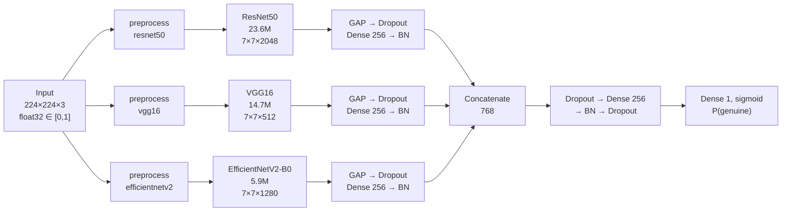
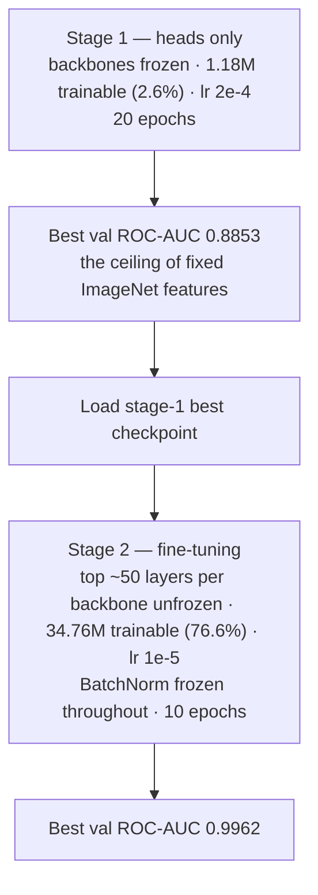
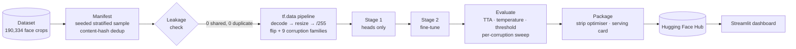

<div align="center">

# OpenForensics — Deepfake Image Detection

**A three-backbone CNN ensemble that decides whether a face image is genuine or manipulated —
with a calibrated confidence score, per-backbone visual explanations, and the evidence behind every number.**

[](https://openforensics.streamlit.app)
[](https://huggingface.co/adarshcod30/openforensics-ensemble)
[](.python-version)
[](requirements.txt)
[](requirements.txt)
[](tests)
[](#licence)

</div>

---

## Results

Held-out test split — 2,000 images, content-hash deduplicated against train and validation,
evaluated with horizontal-flip test-time augmentation.

| Metric | v1 — two backbones | **v2 — three + corruption augmentation** |
|---|---|---|
| Accuracy | 0.8860 | **0.9510** |
| ROC-AUC | 0.9421 | **0.9899** |
| PR-AUC | 0.9527 | **0.9900** |
| Genuine images called fake | 175 / 1000 | **39 / 1000** |
| Validation→test recall gap | 0.159 | **0.025** |
| 10th percentile, genuine test scores | 0.138 | **0.830** |

Both compared at threshold 0.5. The shipped operating point is **0.362**, fitted on validation
via a `target_recall` criterion: **accuracy 0.9480 with 25 false accusations**.

That last row is the substantive result, and the reason v2 exists — see
[The corruption gap](#the-corruption-gap).

---

## Architecture

Three backbones see the same image through their own normalisation, each pools to a
256-dimensional embedding, and the three are concatenated before a shared classifier head.
**45,406,737 parameters.**



Each backbone expects a **different input convention**. Getting this wrong does not raise an
error — it silently starts a branch from a worse initialisation.

| Backbone | Params | Contributes | Expects |
|---|---|---|---|
| ResNet50 | 23,587,712 | Global structure, macro facial geometry | caffe-style `[0,255]`, channel means subtracted |
| VGG16 | 14,714,688 | Fine texture, blending seams | caffe-style `[0,255]`, different channel means |
| EfficientNetV2-B0 | 5,919,312 | Strongest features per parameter | raw `[0,255]` — it rescales internally, so `preprocess_input` is a documented no-op |

### Two-stage training



> **BatchNorm stays frozen during stage 2.** A trainable BatchNorm layer switches to batch
> statistics and overwrites running estimates accumulated over a million ImageNet images,
> using whatever batch size you happen to be training at.

---

## The corruption gap

The test split is measurably more degraded than train and validation. Measured over 400 sampled
images per split and class:

| Split / class | Mean saturation | Near-greyscale | High-frequency energy |
|---|---|---|---|
| Train / Real | 0.3688 | 1.5% | 4.45 |
| Train / Fake | 0.3722 | 0.5% | 4.52 |
| Validation / Real | 0.3570 | 1.2% | 4.67 |
| Validation / Fake | 0.3451 | 6.2% | 5.60 |
| **Test / Real** | **0.2890** | **6.2%** | **5.87** |
| **Test / Fake** | **0.3351** | 3.2% | **5.73** |

Test/Real loses 22% of its colour saturation relative to Train/Real and carries four times the
near-greyscale images, while high-frequency energy — the signature of added noise — rises ~28%.

A model trained only on clean images pays for it **on the tail, not the average**. In v1 the
median score on genuine test images was 0.985, essentially matching validation's 0.998 — but the
10th percentile was **0.138**, meaning a subset of genuine photographs was being called forged
with high confidence.

v2 reproduces nine degradation families during training, applied with probability 0.5 and
stacking up to two deep. The same 10th percentile is now **0.830**, and the validation→test
recall gap fell from 0.159 to 0.025.

### Robustness

Accuracy with a single degradation family applied to the whole test set, one at a time.

| Degradation | Accuracy | ROC-AUC | vs clean | What it does |
|---|---|---|---|---|
| clean | 0.9405 | 0.9899 | — | No degradation |
| occlusion | 0.9300 | 0.9856 | −0.0105 | A region erased and filled |
| jpeg_artifact | 0.9260 | 0.9854 | −0.0145 | Low-quality recompression; blocking |
| desaturate | 0.9255 | 0.9874 | −0.0150 | Colour pulled toward grey |
| colour_cast | 0.9230 | 0.9873 | −0.0175 | Per-channel gain and offset |
| brightness_shift | 0.9210 | 0.9865 | −0.0195 | Heavy under/over-exposure |
| gaussian_noise | 0.9105 | 0.9827 | −0.0300 | Additive sensor-style noise |
| blur | 0.9025 | 0.9798 | −0.0380 | Defocus or resize blur |
| speckle | 0.8745 | 0.9786 | −0.0660 | Sparse bright and dark pixels |
| pixelate | 0.8725 | 0.9623 | −0.0680 | Downscale then upscale |

---

## The dashboard

The [live app](https://openforensics.streamlit.app) is eight pages — a detector plus the evidence
behind it.

| Page | Contents |
|---|---|
| **Overview** | Headline metrics, v1 vs v2 comparison |
| **Detect** | Upload, calibrated prediction, borderline warning, per-backbone Grad-CAM |
| **Model** | Architecture, backbone table, two-stage schedule, serving contract |
| **Training** | Interactive curves for both stages, tabbed ROC-AUC / accuracy / loss |
| **Evaluation** | Confusion matrix, threshold trade-off, abstention curve, calibration |
| **Robustness** | Per-degradation accuracy against the clean baseline |
| **Data** | Split sizes, leakage check, degradation measurements |
| **About** | Limitations, reproduction steps |

The model is **lazy-loaded and only by Detect**. Every other page reads a few tens of kilobytes of
JSON from the Hub, so the site idles at ~53 MB instead of ~900 MB — on a host with roughly a
gigabyte, that is the difference between a site that browses and one that dies on arrival.

---

## Pipeline



Every run writes its exact file list, a content-hash leakage report and its full configuration
alongside the weights, so any number can be traced back to the data that produced it.

---

## Quick start

```bash
git clone https://github.com/adarshcod30/OpenForensics
cd OpenForensics
conda create -n openforensics python=3.11 -y && conda activate openforensics
pip install -e ".[train]"          # serving only: pip install -r requirements.txt
```

> **Do not lower the TensorFlow pin.** The published checkpoints are written by Keras 3.12;
> a Keras 2 install (`tensorflow < 2.16`) cannot deserialise them at all.
> TensorFlow 2.19.1 publishes cp39–cp312 wheels and **no cp313**.

### Use the published model

```python
from huggingface_hub import snapshot_download
import tensorflow as tf, numpy as np, json
from PIL import Image

path  = snapshot_download("adarshcod30/openforensics-ensemble")
model = tf.keras.models.load_model(f"{path}/model.keras", compile=False)
card  = json.load(open(f"{path}/serving.json"))

img = Image.open("face.jpg").convert("RGB").resize((224, 224))
x   = np.asarray(img, dtype="float32")[None] / 255.0
p   = float(model.predict(x)[0, 0])
print("genuine" if p >= card["decision"]["threshold"] else "manipulated", p)
```

Resize to 224×224, scale to `[0,1]`. **Per-backbone normalisation happens inside the model** —
do not apply `preprocess_input` yourself.

### Train, evaluate, publish

```bash
# two stages, ~8 h on an M4; resumable if interrupted
PYTHONPATH=src python -m openforensics.training.train --name v2 \
  --base_dir ./Dataset --backbones resnet50 vgg16 efficientnetv2b0 \
  --train_per_class 10000 --epochs 20 --finetune_epochs 10 --corruption_prob 0.5

# fits temperature and threshold on validation, applies to test
PYTHONPATH=src python -m openforensics.evaluation.evaluate \
  --run_dir runs/v2 --tta --per_corruption

# strips optimiser state, writes the serving card, uploads
PYTHONPATH=src python -m openforensics.export.package \
  --run_dir runs/v2 --push_to <user>/<repo>

# run the dashboard against a local package
OF_MODEL_DIR=runs/v2/serving streamlit run app/app_streamlit.py
```

### Tests

```bash
PYTHONPATH=src pytest tests/ -q
```

---

## Repository layout

```
src/openforensics/
├── config.py              run configuration, serialised into every run
├── gpulock.py             single-writer lock; two TF processes corrupt each other
├── data/
│   ├── manifest.py        seeded splits, content-hash dedup + leakage check
│   ├── corruptions.py     nine degradation families, graph-safe
│   └── pipeline.py        tf.data input pipeline
├── models/
│   ├── layers.py          PreprocessLayer — three backbone conventions
│   └── ensemble.py        builder + BatchNorm-safe unfreezing
├── training/train.py      two-stage, crash-resumable
├── evaluation/
│   ├── metrics.py         TTA, temperature scaling, thresholds, risk-coverage
│   ├── evaluate.py        report generation + per-corruption sweep
│   └── explain.py         per-branch Grad-CAM
└── export/package.py      strip optimiser, build serving card, push to the Hub

app/
├── app.py                 dashboard entry, st.navigation
├── app_streamlit.py       deployment entry point
├── shared.py              cached Hub access; model loaded lazily
└── views/                 the eight pages

tests/                     36 tests
```

`Dataset/` and `runs/` are gitignored. Weights live on the Hub — a 45M-parameter model does not
belong in git.

---

## Dataset

The face-cropped OpenForensics distribution: **190,334 JPEGs at 256×256**, split into
`Train` / `Validation` / `Test`, each with `Fake` and `Real` subfolders. Place it at `./Dataset`.
It is not redistributed here.

Sampling is deterministic and content-hash deduplicated. The raw sample carries **125 images
shared between Train and Validation** and **213 duplicates inside Train**; deduplication draws
until the target count of unique hashes is reached, so split sizes stay exact.

> Trung-Nghia Le, Huy H. Nguyen, Junichi Yamagishi, Isao Echizen.
> *OpenForensics: Large-Scale Challenging Dataset For Multi-Face Forgery Detection And
> Segmentation In-The-Wild.* ICCV 2021.

---

## Design notes

**No face detection.** The images arrive as face crops. Alignment would require landmark
detection and warping, and warping resamples — which smears exactly the blending and compression
traces a forgery detector reads. The pixels are used as delivered.

**Calibration over accuracy.** A detector whose output is an accusation needs a defensible
operating point, not a 0.5 default. Temperature and threshold are both fitted on validation and
applied unchanged to test; the full threshold sweep and a risk-coverage curve ship with the model.

**Evidence travels with the weights.** Training histories, per-stage logs, the evaluation report
and the leakage check are bundled into the serving package, so the dashboard renders them without
the repository or a run directory — neither of which exists on a hosting platform.

---

## Limitations

- **Face crops only.** Behaviour on full scenes, multiple faces or non-face images is undefined —
  there is no face detector in the pipeline.
- **One dataset.** Cross-dataset performance is unmeasured, and the literature is consistent that
  it drops sharply.
- **Predates current generators.** OpenForensics was released in 2021; recent diffusion-based
  manipulations are out of distribution.
- **A margin is not a verdict.** A score near the threshold is inconclusive.
- **Not a forensic authority.** Research and educational use. A prediction is evidence to weigh,
  not proof.

---

## Licence

MIT for the code. The dataset carries its own terms.
